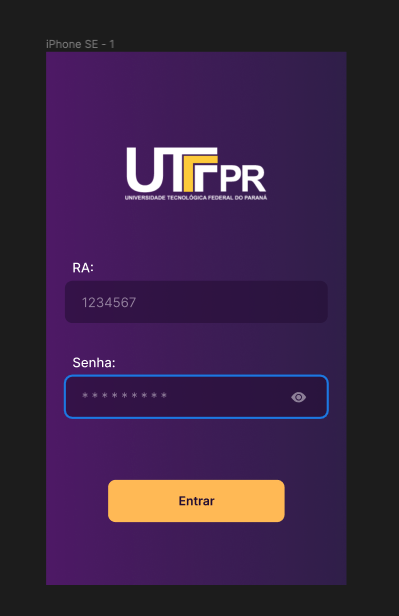

  

<h1 align="center">
  UTFPR Portal do Aluno
</h1>

  The open source UTFPR Portal do Aluno alternative for everyone.  Built with React Native and Expo.

## Features

- Boletim
- Horario
- Matriz
- Crachá
- Registro de Refeições
- Histórico

## Design

  
  

## API Documentation

For more information, see [documentation](https://webapp.utfpr.edu.br/portalAluno/swagger.html) about api.

## Join Us On

## License

- [GGNU Affero General Public License v3.0](./LICENSE.md)
